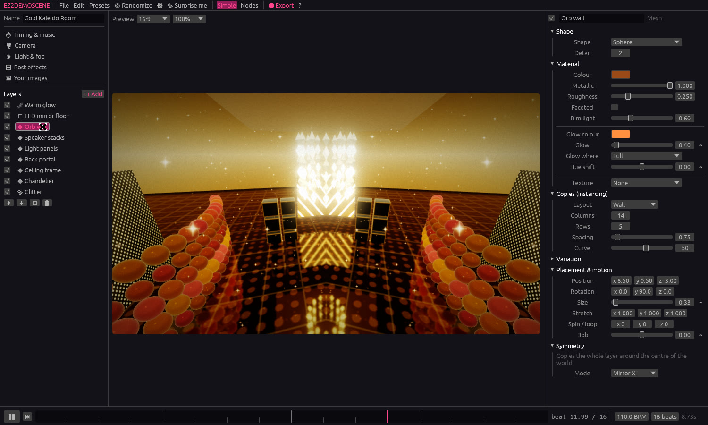
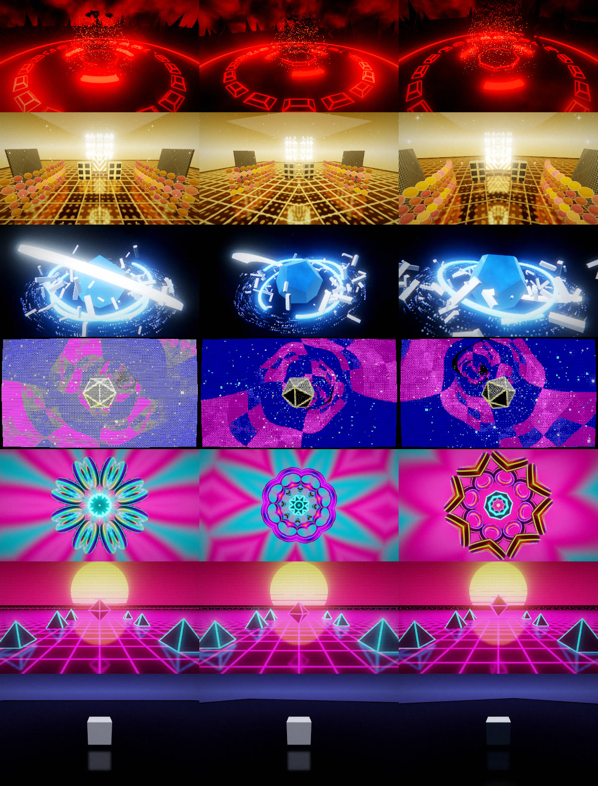

# EZ2DEMOSCENE

**Make loopable, stylised 3D scenes the demoscene way, without writing code.**

EZ2DEMOSCENE is a desktop app (Windows, Linux and macOS), a web app and an
Android app for building short,
seamless 3D loops: neon arenas, mirrored golden halls, glossy solids orbited by
debris, raymarched tunnels, plasma kaleidoscopes and synthwave sunsets. You
start from a preset, tweak layers with sliders, press **Export** and get an
MP4, WebM, GIF or PNG sequence that loops with no visible seam.



📖 **[User manual (PDF)](docs/manual/EZ2DEMOSCENE_User_Manual.pdf)**: a beginner's guide to every feature, with a quick start and recipes. The source is `docs/manual/USER_MANUAL.html`.

## Features

- **Seamless loops.** A loop is a whole number of beats at a chosen BPM.
  Every animation (spins, orbits, pulses, particles, scrolling textures,
  cloud drift, grain) runs an integer number of cycles per loop, so frame
  *N* equals frame 0. The test suite checks this for every preset.
- **Presets + layers for beginners.**
  - Backgrounds: gradient sky, nebula, starfield, raymarched tunnel,
    fractal (Kaliset), oldschool plasma, synthwave sun & grid.
  - Mirror floor: real planar reflections, blur, a glowing neon grid and
    LED textures.
  - Shapes: platonic solids, crystals, shards, beveled tech panels, neon
    ring bands, tori, pyramids, and your own **glTF/GLB/OBJ** models.
  - Copies (instancing): grid, radial, scatter, orbit swarm, curved wall,
    spiral. Each has random tilt, size and hue, plus *size waves* and
    *light chases* that travel across the copies.
  - Symmetry: mirror X/Z/XZ, radial and kaleidoscopic duplication.
  - Particles: burst, drift, ring orbit, fountain, warp stars, vortex and
    glitter, with trails. They are fully deterministic on the GPU, so
    scrubbing and exports are exact.
- **Materials.** Glossy/metallic surfaces with fake studio reflections,
  flat-shaded facets, rim light, and neon glow on the whole surface, along
  polygon edges (Tron look), in stripes, or from a texture.
- **Retro PC textures.** 20 built-in tileable textures (XOR, plasma,
  checkerboard, circuit, tech panel, LED grid, speaker grille, Win9x, copper
  bars, Sierpinski…). Imported images can be *retro-ized*: downscaled,
  palette-reduced and dithered.
- **Post FX.** Bloom, kaleidoscope, mirror split, chromatic aberration,
  pixelation, palette reduction with Bayer dithering (EGA, CGA, C64, Game
  Boy, PICO-8, Amiga copper, ZX Spectrum, VGA cube, phosphor), CRT
  scanlines/curvature/VHS wobble, grading, vignette, grain and beat flash.
- **Animate anything.** Click `~` next to a value to pick a wave (sine,
  triangle, saw, square, beat pulse, random), how many times per loop it
  repeats, and how much it follows the **music**.
- **Music.** Drop in an MP3/WAV/OGG/FLAC. It plays in sync with the loop,
  and its loudness and kick envelopes can drive any value. It is also muxed
  into video exports.
- **Randomize / Surprise me.** Seeded, harmonious mutations (one global hue
  rotation, bounded counts, loop-safe motion), and every change can be
  undone.
- **Node graph (advanced mode).** Source layers flow through modifiers
  (Symmetry, Array, Spin, Offset, Scale, Tint, Merge) into Output. The
  graph compiles to the same layer list the simple mode uses, and *Bake to
  layers* brings it back into simple mode.
- **Project files.** Readable `.ez2.json` files. Static values are saved as
  plain numbers, and assets inside the project folder are stored with
  relative paths, so projects can be moved.
- **Packs.** A `.ez2pack` is one zip file holding a project plus every model,
  image and music file it uses, for sharing or archiving.
- **Autosave & crash recovery.** Unsaved work is autosaved every 30 s and
  offered back after a crash.
- **Your library.** "Save as my preset" (with a thumbnail) and "Save layer as
  template" keep your own building blocks across projects.
- **Viewport gizmos.** Click to select, then drag handles to move, rotate or
  scale (W/E/R). Hold Ctrl to snap, and press G for the ground grid.
- **Performance meter.** Shows fps, triangle and particle counts, the most
  expensive layers, and a ⚠ on heavy layers. Static copies are cached.



## Downloads

- **Web app:** <https://roganis.github.io/ez2demoscene/>. Runs in Chrome, Edge or
  Firefox on desktop and in Chrome on Android. It can be installed as a PWA and
  works offline after the first visit.
- **Android APK:** built by `.github/workflows/android.yml`. Every push has a debug APK
  as a workflow artifact, and tagged releases attach it (plus a signed release APK
  when the signing secrets are set).

Tagged releases (`v*`) are built for Windows, Linux and macOS by
`.github/workflows/release.yml`. The Windows and Linux archives include
ffmpeg. On macOS, run `brew install ffmpeg`.

## Getting started

Requirements:

- Rust **1.95+** (`rustup update stable`)
- A GPU with Vulkan, DX12 or Metal support
- On Linux, the ALSA and X11/Wayland dev packages:
  `sudo apt install libasound2-dev libxkbcommon-dev libwayland-dev`
- For video and GIF export, [ffmpeg](https://ffmpeg.org) on your `PATH`
  (or point the export dialog at it). PNG sequences need nothing extra.

```sh
cargo run --release                 # opens the editor
cargo run --release -- my.ez2.json  # opens a project
```

### Using the editor

1. **Pick a preset** in the gallery (or click *Surprise me*).
2. **Layers** (left): toggle, reorder, duplicate or add backgrounds, shapes,
   particles, a mirror floor, or a 3D model.
3. **Inspector** (right): edit the selected layer, camera, light & fog,
   post effects, timing & music, or your images.
4. **Timeline** (bottom): play/pause (Space), scrub, set BPM and loop
   length. Beat ticks show where pulses land.
5. **Viewport**: drag to turn the camera, scroll to zoom.
6. **Export** (Ctrl+E): pick a format, size, frame rate and how many
   times to repeat the loop.

Drag & drop works for projects, models (`.gltf .glb .obj`), images
(which are applied to the selected shape) and music.

Shortcuts: `Space` play/pause · `Ctrl+S` save · `Ctrl+O` open · `Ctrl+E` export ·
`Ctrl+Z` / `Ctrl+Shift+Z` undo/redo.

### Command line (no window)

```sh
ez2demoscene --list-presets
ez2demoscene --render "Neon Arena" still.png --phase 0.25 --size 1920x1080
ez2demoscene --export "Gold Kaleido Room" loop.mp4 --size 1920x1080 --fps 60 --repeats 4
ez2demoscene --export my.ez2.json frames/        # PNG sequence
ez2demoscene --write-presets assets/presets
ez2demoscene --write-textures assets/textures
```

## Project layout

| Crate | What it does |
|---|---|
| `crates/ez_core` | Scene model (serde), loop clock, animatable `Param`s, camera/instancing/symmetry math, presets, randomizer, node graph compiler. No GPU dependencies. |
| `crates/ez_render` | wgpu renderer: procedural meshes, glTF/OBJ import, texture generator, WGSL shaders (SDF backdrops, lit instanced meshes, analytic particles, mirror floor, bloom, kaleido, retro post). |
| `crates/ez_export` | Offline loop rendering to PNG / ffmpeg (MP4, WebM, GIF), plus the audio envelope analysis. |
| `crates/ez_app` | The egui editor (`ez2demoscene` binary) and the CLI. On wasm it swaps in `library_web.rs` (IndexedDB), `audio_web.rs` (HTML audio) and `export_web.rs` (WebCodecs/GIF/PNG zip). |
| `web/` | Trunk entry point for the web build: `index.html`, PWA manifest, service worker, the WebCodecs bridge (`ez2_video.js`) and vendored MIT muxers. |
| `android-app/` | Capacitor wrapper that packages the web build as an Android app. |
| `assets/presets` | Built-in presets as project files (generated). |
| `assets/textures` | The built-in retro texture pack as PNGs (generated, CC0). |

### How the loop guarantee works

- `EvalCtx.phase` goes from 0 to 1 over the loop. `Param` oscillators use
  `cycles: i32`, and spins, orbits and texture scrolls are whole turns or
  tiles per loop.
- Each particle's age is `fract(phase * lives + hash(id))`, with an integer
  number of lives. Its position is an analytic function of `(id, age)`, so
  there is no simulation state.
- Noise-based backgrounds move on closed circles through noise space.
- Film grain and VHS noise are hashed from a frame id that wraps with the loop.
- The exporter renders frames at `i / N` for `i` in `0..N`, so the first
  frame is never duplicated at the end.

## Web and Android builds

```sh
rustup target add wasm32-unknown-unknown
cargo install trunk --locked          # or download a trunk release binary
cd web && trunk serve                 # http://127.0.0.1:8080, rebuilds on change
cd web && trunk build --release       # → dist/ (what GitHub Pages serves)

# Android (needs Node 22+, JDK 21 and the Android SDK, ANDROID_HOME set)
cd android-app && npm ci && npm run build:debug
# → android-app/android/app/build/outputs/apk/debug/app-debug.apk
```

`.github/workflows/pages.yml` deploys `dist/` to GitHub Pages on every push to
`main` (one-time setup: Settings → Pages → Source: *GitHub Actions*). The web
version renders with WebGPU where available, falling back to WebGL2. Imported
files, presets and the autosave live in IndexedDB. The phone layout kicks in
below 820 logical pixels. Automated browser tests can start an export with
`?ez2test=gif|zip|mp4|webm` (optionally `&preset=<name>`).

## Rebuilding the manual

```sh
chromium --headless --no-pdf-header-footer --allow-file-access-from-files \
  --print-to-pdf=docs/manual/EZ2DEMOSCENE_User_Manual.pdf docs/manual/USER_MANUAL.html
```

## Development

```sh
cargo test --workspace   # GPU tests skip themselves if no adapter is found
cargo clippy --workspace --all-targets
cargo run -p ez_render --example contact_sheet -- sheet.png 480   # render all presets
cargo run --release -p ez_render --example bench                 # renderer timing
EZ2_BLESS=1 cargo test -p ez_render --test golden                # update golden images after an intended visual change
```

On a machine without a GPU, Mesa's `lavapipe` (package `mesa-vulkan-drivers`)
is enough to run the tests and exports.

## License

GPL-3.0-or-later. The generated texture pack in `assets/textures` is released
under CC0.
