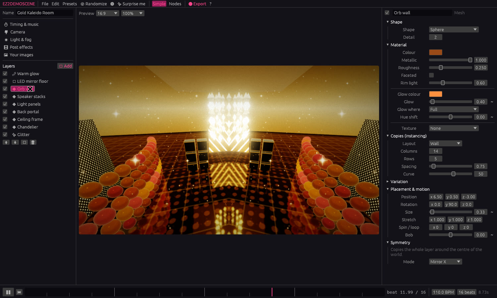
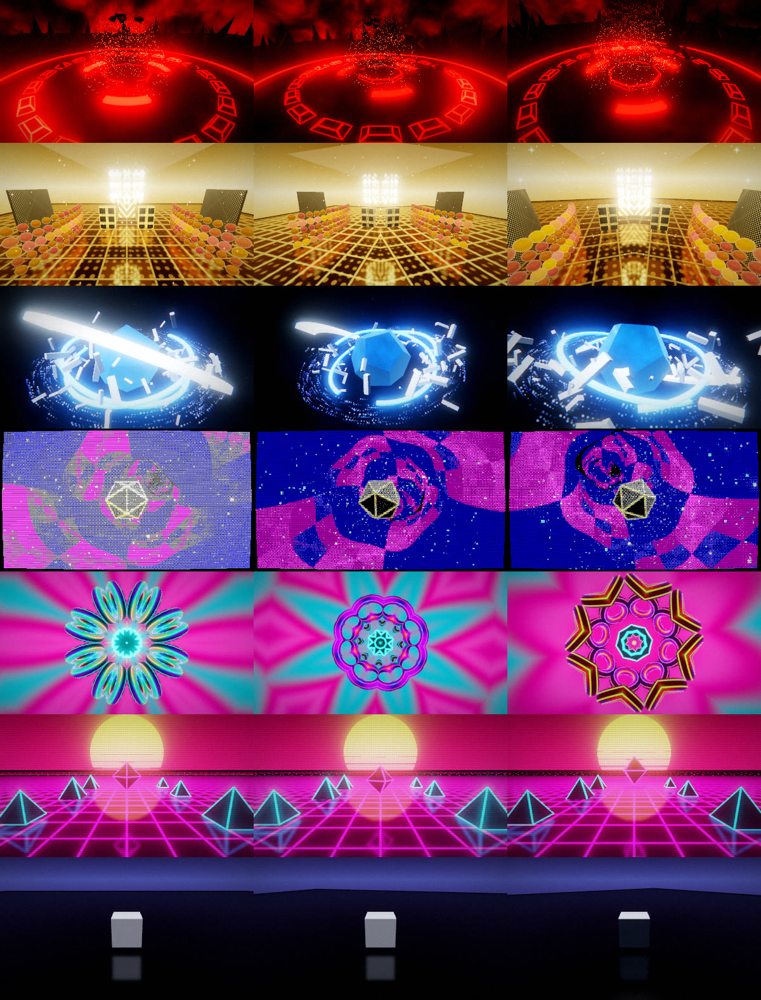

# EZ2DEMOSCENE

**Make loopable, stylised 3D scenes the demoscene way, without writing code.**

EZ2DEMOSCENE is a desktop app (Windows, Linux and macOS), a web app and an
Android app for building short,
seamless 3D loops: neon arenas, mirrored golden halls, glossy solids orbited by
debris, raymarched tunnels, plasma kaleidoscopes and synthwave sunsets. You
start from a preset, tweak layers with sliders, press **Export** and get an
MP4, WebM, GIF or PNG sequence that loops with no visible seam.



📖 **[User manual (PDF)](docs/manual/EZ2DEMOSCENE_User_Manual.pdf)**: a beginner's guide to every feature, with a quick start and recipes. The source is `docs/manual/USER_MANUAL.html`.

## Features

- **Seamless loops.** A loop is a whole number of beats at a chosen BPM.
  Every animation (spins, orbits, pulses, particles, scrolling textures,
  cloud drift, grain) runs an integer number of cycles per loop, so frame
  *N* equals frame 0. The test suite checks this for every preset.
- **Presets + layers for beginners.**
  - Backgrounds: gradient sky, nebula, starfield, oldschool plasma,
    synthwave sun & grid, and four raymarched ones with their own
    settings: tunnel (5 shapes, wall patterns, twist, light rings),
    fractal (3 formulas, fold, zoom), Menger sponge flight (sponge, beam
    lattice, cube field) and a ring corridor. Plus two skies:
    **volumetric clouds** (raymarched, sun-lit, fluffy / overcast / storm)
    and an **aurora** night sky. And a **battle background** in the style
    of 16-bit RPGs: two tiled patterns (rings, diamonds, zigzags,
    bricks, plasma, your picture…) scrolling and wobbling line by line
    (wave, interlaced, compression) while the colours cycle through them.
  - Mirror floor: real planar reflections, blur, a glowing neon grid and
    LED textures.
  - Shapes: 25 built-ins (platonic solids, crystals, shards, beveled tech
    panels, neon ring bands, tori, torus knots, springs, gears, stars,
    gems, hearts, a Möbius strip, a Menger sponge…), a **library of about
    1,000 low-poly models** (spaceships, vehicles, trees, food, buildings,
    characters… by Kenney, CC0) picked from tiles with previews, and your
    own **glTF/GLB/OBJ** models.
  - **Cloth**: flags, curtains, banners or a sheet draped over a ball,
    blown by a wind that can turn and gust on the beat. Position-based
    dynamics simulated ahead of time into a loop (like flocks), drawn as a
    shape with every material, texture, copy and shadow option.
  - Morph: any shape or model melts into another like liquid (holes open
    and close, parts bud off), with an animatable amount.
  - Copies (instancing): grid, radial, scatter, orbit swarm, curved wall,
    spiral. Each has random tilt, size and hue, plus *size waves* and
    *light chases* that travel across the copies.
  - Symmetry: mirror X/Z/XZ, radial and kaleidoscopic duplication.
  - Particles: burst, drift, ring orbit, fountain, warp stars, vortex and
    glitter, with trails. They are fully deterministic on the GPU, so
    scrubbing and exports are exact.
  - Terrain: an endless wireframe or solid (optionally textured) landscape
    that scrolls past and repeats exactly every loop. Six shapes (hills,
    ridged mountains, mesas, dunes, canyons, craters), biomes that colour
    it by height and slope (alpine, desert, volcanic, arctic, alien), and
    **water, lava, toxic goo or ice** filling the low ground, with
    ripples, sun glints, foam, a churning crust or bubbles. Level of
    detail keeps full resolution near the camera with a quarter of the
    triangles.
  - Text: still text, scrollers, sine scrollers, typewriters and greetings
    lists, in a crisp pixel font, Mono, Sans or your own TTF/OTF, with
    gradients, glow, outline, drop shadow and chrome (signed-distance
    atlas). Shapes can also be **3D text**: extruded logos (voxel letters
    with the pixel font) with every material option.
    **Raymarched shapes** (metaballs, gyroid, fractal bulb, melting box)
    are drawn per pixel inside a box: smooth, depth-correct against
    everything else, with sun shadows and the usual material.
  - **Sprites**: billboards, upright or fixed image planes with alpha,
    additive or cutout blending and any copy layout; sprite sheets play a
    whole number of times per loop (built-in explosion, flame, coin and
    sparkle sheets).
  - **Copies on the GPU**: every copy layout (grid, ring, scatter, orbit,
    wall, spiral, curve, big swarms of up to 250,000 in orbits, a cloud,
    a shell or a spiral galaxy) is placed with its variation by a compute
    shader on desktop and WebGPU; WebGL2 runs the same maths on the CPU.
  - **Flocks** (a copy layout): boids that keep apart, fly together and
    follow a target (still, animated, music-linked or travelling a
    curve), bank into turns and scatter on hits. Simulated ahead of time
    into a loop (on a thread; in the browser a slice per frame) with the
    same result on every platform: each boid keeps a loose place in a
    formation so the flight nearly repeats, and the end of the loop steers
    back to its start. Exports wait for the simulation.
  - **Physics** (a copy layout): rigid boxes or balls. *Rain* drops them
    on a schedule that repeats every loop; they pile up, then shrink or
    sink away. *Stack and blast* builds a wall or tower that a blast
    knocks down on a chosen beat and that rebuilds itself (ping-pong);
    with no gravity it bursts apart in space. Simulated ahead of time,
    with the same result everywhere.
  - **Liquid** (a copy layout): position-based fluid droplets in a box, a
    bowl or a pool, filled or poured in from a spout, sloshing as the
    layer tilts (a new animatable *Tilt*; the new *Bowl* shape rocks
    with it) and stirrable by the music. Drawn as droplets (any shape or
    glowing sprites) or as one smooth **liquid surface** in the layer's
    material; the loop closes by cross-fading. *Liquid Gold* rocks a bowl
    of molten gold.
  - **Logos**: text or an image laid flat on the screen (snapped to a
    part of the screen or against another logo, which it then follows,
    like a photo editor's reference points; size and turn animatable),
    drawn before the post effects
    but after depth of field. The shape is baked into a signed distance
    field, so outlines, glow, drop shadows and a chrome bevel work on any
    image, at any size. Bevels (round, chiselled, stepped, pillow) lit by
    a light that can circle or follow the beat, material spheres
    (matcaps: gold, chrome, plastic, candy or your own) and a glint
    sweeping across a whole number of times per loop. Distance-field
    effects: rings rippling out from the edges, stacked outlines, a fake
    extrusion, dissolving with a burning edge, reveals (grow, edges first,
    wipe, circle) and morphing into another text or image. Rasters and
    distortion: copper bars, sine sway and bob, raster glitch slices and
    chromatic split. Retro looks: pixel blocks (animatable, to pixelate
    in), retro palettes with ordered dither and palette cycling, halftone
    dots, scanlines with phosphor stripes, and moiré. Logos meet the
    scene: glass letters bending what is behind them, god rays from the
    logo (or its shadow in the light behind), and echo trails.
  - **Electric arcs**: tesla lightning between two points, to the nearest
    copies of a shape (jumping as they move) or copy to copy, crawling and
    re-striking a whole number of times per loop.
  - Weather: rain with splashes, snow, rising embers, a sandstorm or
    fireflies in a box that follows the camera, and **lightning** bolts
    whose flash lights up the scene. Rain wets every surface (gloss,
    puddles with ripples); snow settles on everything facing up.
  - Waterfalls of water, lava or goo, with foam, spray or smoke.
  - Laser beams or hazy **spotlight cones** with pools of light.
  - Particles can be smoke instead of glow, and there is a tornado
    emitter.
  - **Colour scheme**: one key colour and a harmony rule (one hue,
    neighbours, opposites, split, triad, square) that every colour of the
    project follows. Each keeps its lightness (worked out in OKLCH) while its
    hue moves to the scheme; stored colours stay, layers can opt out, and
    the scheme can turn round the colour wheel a whole number of times
    per loop.
  - **Sun shadows** (soft shadow map) and contact shadows on floors.
  - **Environment light** (image-based lighting): shapes are lit and
    reflect a panorama photo (a `.hdr` file), one of four built-in
    studios (softbox, overcast, sunset, neon room) or the scene's own
    background. The map turns (whole turns per loop), its brightest spot
    can become the sun with shadows, and a background can show it.
    Blurred for rough surfaces ahead of time (split-sum GGX, spherical
    harmonics for diffuse light); the *Chrome Studio* preset shows it off.
  - **Reflections** (screen-space): shiny shapes, water and rain puddles
    reflect what is around them on the screen, blending back to the
    environment where the screen runs out; the mirror floor keeps its own
    exact reflection. Half resolution, no history, so it loops.
  - **Light shafts**: the fog (and mist) lit by the sun wherever the sun
    reaches it, so shapes and terrain cut dark bands through the haze,
    even with the sun off screen (marched through the sun shadow map).
    The *Cathedral Light* preset streams low sunlight between columns.
  - Atmosphere: **mist** pooling in valleys, underwater **caustics**, a
    **rainbow**, and a **day & night cycle** with sunsets, stars and a
    moon.
  - Laser beams: fans, rotating cones or scattered beams that sweep and
    strobe on the beat.
  - Neon ribbons: glowing tubes along Lissajous, knot, figure-eight, wave
    or rose curves, with light pulses running along them.
  - Blink / strobe on any layer: rhythmic or random blinking and beat
    flashes.
- **Materials.** Classic or **physical** shading (GGX highlights,
  split-sum reflections with multiple scattering, so rough metals keep
  their energy), clearcoat, sheen and glass, occlusion/roughness/metal and
  glow maps, and nine one-click presets (gold, copper, chrome, brushed
  steel, rubber, car paint, glass, velvet, ceramic). glTF models bring
  their own PBR material and pictures (Classic keeps the original fake
  studio reflections). Flat-shaded facets, rim light, and neon glow on
  the whole surface, along
  polygon edges (Tron look), in stripes, or from a texture. **Relief**
  adds bump maps, normal maps and real displacement (with subdivision).
  **Glitch**
  corrupts a shape's geometry (jitter, VHS slices, shatter) in loop-safe
  bursts.
- **Retro PC textures.** 33 built-in tileable textures (XOR, plasma,
  checkerboard, circuit, tech panel, LED grid, speaker grille, Win9x, copper
  bars, Sierpinski, Tron grid, Truchet, the C64 10 PRINT maze, Matrix rain,
  CRT phosphors…). Imported images can be *retro-ized*: downscaled,
  palette-reduced and dithered, and tiled *mirrored* so photos repeat
  without seams.
- **Retro 3D (5th-generation consoles).** Draw the whole 3D scene like
  a PlayStation: at **320 × 240, 256 × 224, 640 × 480** or your own size
  with native aliasing and square-pixel upscaling (text and logos can
  stay sharp), **vertex snapping** (the PS1 wobble), **affine texture
  warp** (reduced by subdividing, as PS1 games did), and per-material
  texture filters: nearest, bilinear without mipmaps and the N64's
  **3-point** filter. Per-polygon **15-bit colour with 4×4 dither**,
  **N64 fog** starting close to the camera and the N64 **video blur**
  (de-dither and soften), **Saturn mesh transparency** (checkerboard
  see-through shapes and sprites) and PS1 **near-plane culling**. One
  click turns on the PlayStation, Saturn, Nintendo 64 or Quake bundle.
- **Quake features.** **Light styles** (flicker strings from 'a' dark to
  'z' bright, playing a whole number of times per loop) on the sun and
  ambient light, glows, sprites and particles; **turbulent warp** for
  water, lava and slime textures, terrain liquids and waterfalls; a
  **two-layer scrolling sky**; **palette lighting** (colormap) through our
  own 256-colour palette with fullbrights, or any retro palette; and
  solid **square particles**.
- **Post FX.** Bloom, **god rays** (light shafts from the sun or the
  picture centre) with lens flare, **heat haze**, **depth of field**
  (auto focus, round bokeh), **feedback trails** (zoom/turn/hue-drifting
  echoes that still loop exactly), kaleidoscope, mirror split, chromatic aberration,
  pixelation, palette reduction with Bayer dithering (EGA, CGA, C64, Game
  Boy, PICO-8, Amiga copper, ZX Spectrum, VGA cube, phosphor), CRT
  scanlines/curvature/VHS wobble, **line wobble** (retro RPG wave,
  interlaced or compression), **VHS tape** (jittering lines, a torn
  tracking band, colour bleed, snow), **ASCII art** (picture colours or
  green/amber terminal), a **fisheye lens** (and its opposite), grading,
  vignette, grain and beat flash.
- **Animate anything.** Click `~` next to almost any value, post effects
  included, to pick a shape: LFOs (sine, triangle, saw up/down, square),
  beat fades (pulse, exponential and linear fades in/out, swell) or random
  (sample & hold, smooth random, drunken walk). The ♩ menu syncs it to
  every beat, bar or loop, a live graph previews the curve, and it can
  follow the **music**. Layers can also **shake** on the beat.
- **Scenes & timeline.** Several scenes (each with its own layers, camera,
  light and effects) played by a timeline of clips with transitions:
  crossfade, wipe, iris, flash, glitch or a cut on the next kick. The
  whole timeline is the loop; each scene keeps looping inside its clips.
  With a song, clips can follow its sections (drops, breakdowns).
- **Camera.** Orbit, pendulum, static or a **path**: a smooth closed
  flight through your own shots (position, look-at, field of view, roll)
  at an even speed, with optional lingering, cuts to the next shot on
  every kick, and a punch-in zoom on hits. The viewport draws the flight.
- **Music.** Drop in an MP3/WAV/OGG/FLAC. It is analysed once: loudness,
  kick, bass, mids, highs and brightness, hits (kicks, snares, hats,
  onsets, notes), a 16-band spectrum, the melody's note and the tempo.
  The analysis runs in the background, so the editor never freezes.
  - Any value can **follow** a source or play a fade **on each hit** (the
    🎵 row of its `~` panel), e.g. glow on every kick, hue from the melody.
  - **Time warp** makes motion surge with the music while the loop still
    ends where it started.
  - **Equalizer** copies grow with the spectrum bands.
  - Loop a window of the song (seamless, snapped to the detected tempo) or
    run through the **whole song**; video exports mux the matching audio.
  - **MIDI files** give exact drum hits and melody; **live input**
    (microphone / line-in) drives the preview for VJ sets.
- **Randomize / Surprise me.** Seeded, harmonious mutations (one global hue
  rotation, bounded counts, loop-safe motion), and every change can be
  undone.
- **Node graph (advanced mode).** Source layers flow through modifiers
  (Symmetry, Array, Spin, Offset, Scale, Tint, Jitter, Mirror, Strobe,
  Colour/material, Merge) into Output. The
  graph compiles to the same layer list the simple mode uses, and *Bake to
  layers* brings it back into simple mode.
  - **Shape and layout nodes:** Deform (twist, bend, taper, wobble,
    explode, in the vertex shader), Colours across copies (gradient or
    steps, travelling along them), and layouts that take a second
    *reference* input: Along a curve (follow a ribbon), On a surface
    (spread evenly over another shape) and On a terrain (stand on the
    landscape, riding its scroll; the height field is ported to the CPU).
    All of these are in Simple mode too.
  - **Signals:** green wires carry a number that changes over the loop.
    Wave/music, Math, Remap, Quantize, Smooth, Mix, Sequence and Hit
    counter nodes (each with a live graph of its value) feed **Drive**
    nodes, which set any setting of the layers flowing through them
    (replace, add or multiply). Loop-safe by construction.
- **Project files.** Readable `.ez2.json` files. Static values are saved as
  plain numbers, and assets inside the project folder are stored with
  relative paths, so projects can be moved.
- **Packs.** A `.ez2pack` is one zip file holding a project plus every model,
  image and music file it uses, for sharing or archiving.
- **Autosave & crash recovery.** Unsaved work is autosaved every 30 s and
  offered back after a crash.
- **Your library.** "Save as my preset" (with a thumbnail) and "Save layer as
  template" keep your own building blocks across projects.
- **Viewport gizmos.** Click to select, then drag handles to move, rotate or
  scale (W/E/R). Hold Ctrl to snap, and press G for the ground grid.
- **Performance meter.** Shows fps, triangle and particle counts, the most
  expensive layers, and a ⚠ on heavy layers. Static copies are cached.



## Downloads

- **Web app:** <https://roganis.github.io/ez2demoscene/>. Runs in Chrome, Edge or
  Firefox on desktop and in Chrome on Android. It can be installed as a PWA and
  works offline after the first visit.
- **Android APK:** built by `.github/workflows/android.yml` on every push.
  - Newest build of `main`: the [`android-latest`](https://github.com/roganis/ez2demoscene/releases/tag/android-latest) prerelease.
  - Newest build of a work branch: the [`android-preview`](https://github.com/roganis/ez2demoscene/releases/tag/android-preview) prerelease.
  - Every run also keeps the APK as a workflow artifact, and tagged releases attach it
    (plus a signed release APK when the signing secrets are set).

- **Desktop (Windows, Linux, macOS):** built by `.github/workflows/release.yml`.
  - Newest build of `main`: the [`desktop-latest`](https://github.com/roganis/ez2demoscene/releases/tag/desktop-latest) prerelease.
  - Tagged releases (`v*`) attach the same archives.
  - The Windows and Linux archives include ffmpeg. On macOS, run `brew install ffmpeg`.
  - If the app crashes or hangs at start, it tries another graphics backend on
    the next start (DirectX 12, then OpenGL, then Vulkan on Windows). You can also
    pick one in **Graphics**, or set `WGPU_BACKEND=gl` (or `dx12`, `vulkan`).

## Getting started

Requirements:

- Rust **1.95+** (`rustup update stable`)
- A GPU with Vulkan, DX12 or Metal support
- On Linux, the ALSA and X11/Wayland dev packages:
  `sudo apt install libasound2-dev libxkbcommon-dev libwayland-dev`
- For video and GIF export, [ffmpeg](https://ffmpeg.org) on your `PATH`
  (or point the export dialog at it). PNG sequences need nothing extra.

```sh
cargo run --release                 # opens the editor
cargo run --release -- my.ez2.json  # opens a project
```

### Using the editor

1. **Pick a preset** in the gallery (or click *Surprise me*).
2. **Layers** (left): toggle, reorder, duplicate or add backgrounds, shapes,
   particles, a mirror floor, or a 3D model.
3. **Inspector** (right): edit the selected layer, camera, light & fog,
   post effects, timing & music, or your images.
4. **Timeline** (bottom): play/pause (Space), scrub, set BPM and loop
   length. Beat ticks show where pulses land.
5. **Viewport**: drag to turn the camera, scroll to zoom.
6. **Export** (Ctrl+E): pick a format, size, frame rate and how many
   times to repeat the loop.

Drag & drop works for projects, models (`.gltf .glb .obj`), images
(which are applied to the selected shape) and music.

Shortcuts: `Space` play/pause · `Ctrl+S` save · `Ctrl+O` open · `Ctrl+E` export ·
`Ctrl+Z` / `Ctrl+Shift+Z` undo/redo.

### Command line (no window)

```sh
ez2demoscene --list-presets
ez2demoscene --render "Neon Arena" still.png --phase 0.25 --size 1920x1080
ez2demoscene --export "Gold Kaleido Room" loop.mp4 --size 1920x1080 --fps 60 --repeats 4
ez2demoscene --export "Orbiting Solid" smooth.mp4 --fps 30 --motion-blur 8   # film-like motion blur
ez2demoscene --export my.ez2.json frames/        # PNG sequence
ez2demoscene --write-presets assets/presets
ez2demoscene --write-textures assets/textures
```

## Project layout

| Crate | What it does |
|---|---|
| `crates/ez_core` | Scene model (serde), loop clock, animatable `Param`s, camera/instancing/symmetry math, presets, randomizer, node graph compiler. No GPU dependencies. |
| `tools/model_library.py` | Builds `assets/models/library.zip`, the bundled model library, from Kenney's CC0 packs. |
| `crates/ez_render` | wgpu renderer: procedural meshes, glTF/OBJ import, texture generator, WGSL shaders (SDF backdrops, lit instanced meshes, analytic particles, mirror floor, bloom, kaleido, retro post). |
| `crates/ez_export` | Offline loop rendering to PNG / ffmpeg (MP4, WebM, GIF), plus the audio envelope analysis. |
| `crates/ez_app` | The egui editor (`ez2demoscene` binary) and the CLI. On wasm it swaps in `library_web.rs` (IndexedDB), `audio_web.rs` (HTML audio) and `export_web.rs` (WebCodecs/GIF/PNG zip). |
| `web/` | Trunk entry point for the web build: `index.html`, PWA manifest, service worker, the WebCodecs bridge (`ez2_video.js`) and vendored MIT muxers. |
| `android-app/` | Capacitor wrapper that packages the web build as an Android app. |
| `assets/presets` | Built-in presets as project files (generated). |
| `assets/textures` | The built-in retro texture pack as PNGs (generated, CC0). |

### How the loop guarantee works

- `EvalCtx.phase` goes from 0 to 1 over the loop. `Param` oscillators use
  `cycles: i32`, and spins, orbits and texture scrolls are whole turns or
  tiles per loop.
- Each particle's age is `fract(phase * lives + hash(id))`, with an integer
  number of lives. Its position is an analytic function of `(id, age)`, so
  there is no simulation state.
- Noise-based backgrounds move on closed circles through noise space.
- The day cycle, caustics, heat haze, waterfall streaks and rain ripples
  all move a whole number of times per loop.
- Weather drops fall a whole number of times per loop, and lightning
  strikes are picked from time slots that wrap with the loop. Liquid
  currents drift a whole number of terrain lengths per loop.
- Music in a loop window is sampled as a circle (curves fade into the
  window's start, hits ring on past the loop point); time warp is
  rescaled to end each loop exactly where it began.
- Volumetric clouds can drift any distance: two copies of the cloud field,
  half a loop apart, cross-fade, so each one jumps back while invisible.
- Film grain and VHS noise are hashed from a frame id that wraps with the loop.
- The exporter renders frames at `i / N` for `i` in `0..N`, so the first
  frame is never duplicated at the end.

## Web and Android builds

```sh
rustup target add wasm32-unknown-unknown
cargo install trunk --locked          # or download a trunk release binary
cd web && trunk serve                 # http://127.0.0.1:8080, rebuilds on change
cd web && trunk build --release       # → dist/ (what GitHub Pages serves)

# Android (needs Node 22+, JDK 21 and the Android SDK, ANDROID_HOME set)
cd android-app && npm ci && npm run build:debug
# → android-app/android/app/build/outputs/apk/debug/app-debug.apk
```

`.github/workflows/pages.yml` deploys `dist/` to GitHub Pages on every push to
`main` (one-time setup: Settings → Pages → Source: *GitHub Actions*). The web
version renders with WebGPU where available, falling back to WebGL2. Imported
files, presets and the autosave live in IndexedDB. The phone layout kicks in
below 820 logical pixels. Automated browser tests can start an export with
`?ez2test=gif|zip|mp4|webm` (optionally `&preset=<name>`).

## Rebuilding the manual

```sh
chromium --headless --no-pdf-header-footer --allow-file-access-from-files \
  --print-to-pdf=docs/manual/EZ2DEMOSCENE_User_Manual.pdf docs/manual/USER_MANUAL.html
```

## Development

```sh
cargo test --workspace   # GPU tests skip themselves if no adapter is found
cargo clippy --workspace --all-targets
cargo run -p ez_render --example contact_sheet -- sheet.png 480   # render all presets
cargo run --release -p ez_render --example bench                 # renderer timing
EZ2_BLESS=1 cargo test -p ez_render --test golden                # update golden images after an intended visual change
```

On a machine without a GPU, Mesa's `lavapipe` (package `mesa-vulkan-drivers`)
is enough to run the tests and exports.

## License

GPL-3.0-or-later. The generated texture pack in `assets/textures` is released
under CC0.
